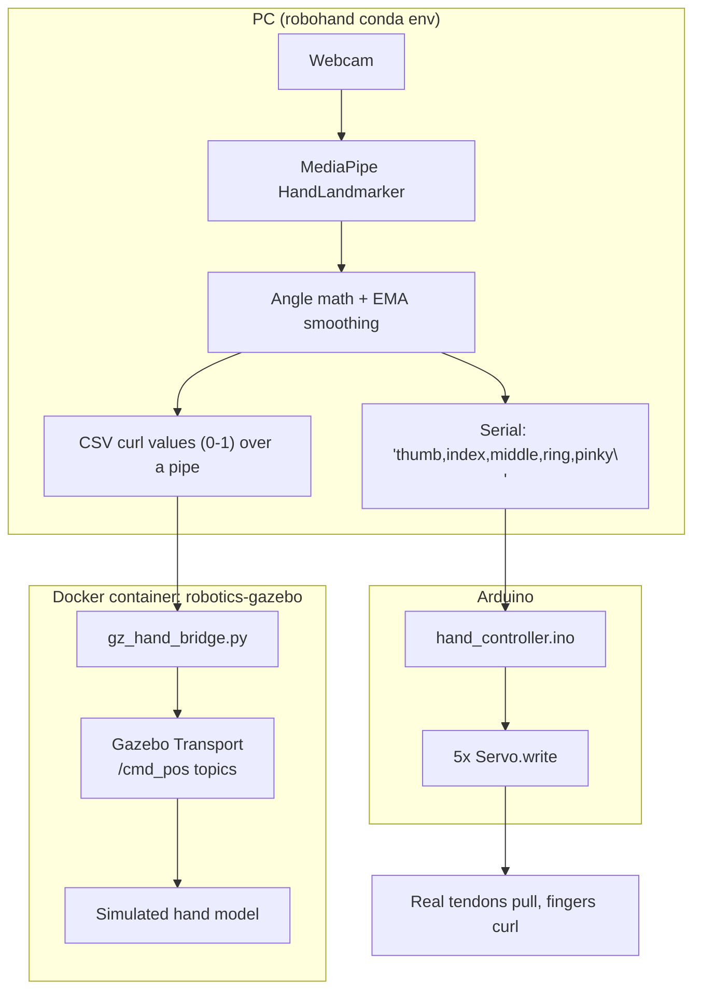

# Architecture

The project is four independent pieces connected by two narrow interfaces (a serial line, and a
pub/sub message bus for the simulation). Each piece can be developed and tested on its own.

## Why it's split this way

**The vision code doesn't know about servos, and the firmware doesn't know about MediaPipe.** The
interface between them is a plain serial line carrying 5 numbers — that's it. This means:

- You can test the vision pipeline with zero hardware (`--no-serial`).
- You can test the firmware/servos with a serial terminal, typing angles by hand, no webcam needed.
- The simulation is a third consumer of the *same* tracked-angle data, not a special case bolted onto
  the vision code — see [why the sim bridge is a separate process](simulation.md#why-a-separate-process-not-a-library-call).

## The four pieces

| Piece | Where | Runs in |
|---|---|---|
| Vision (hand tracking + angle math) | `vision/` | `robohand` conda env, on the host |
| Firmware (servo control) | `firmware/hand_controller/` | Arduino |
| Simulation bridge | `sim/bridge/gz_hand_bridge.py` | Inside the `robotics-gazebo` Docker container |
| Simulation world/model | `sim/worlds/`, `sim/models/` | Gazebo, inside the same container |

## Data flow, step by step

1. **Webcam frame → landmarks.** MediaPipe's `HandLandmarker` returns 21 (x, y, z) points per
   detected hand — wrist, and 4 joints per finger. See [Vision Pipeline](vision.md).
2. **Landmarks → angle per finger.** For each finger, the angle at the middle joint (wrist→MCP→tip
   for four fingers, base→joint→tip for the thumb) is computed with the law of cosines. 180° = fully
   straight, smaller = more curled.
3. **Angle → smoothed angle.** Raw landmark positions jitter slightly frame to frame even when your
   hand is perfectly still. An exponential moving average (EMA) filters that out before anything is
   sent downstream.
4. **Angle → command.** Two consumers read the smoothed angle differently:
     - For the **real hand**: mapped to a servo angle (0-180) and sent as a comma-separated line
       over serial, once per frame.
     - For the **simulation**: converted to a 0.0-1.0 "curl fraction" and streamed to the Gazebo
       bridge process as CSV.
5. **Command → motion.** The Arduino parses the serial line and calls `Servo.write()` per finger.
   The Gazebo bridge publishes each curl value to that finger's `/cmd_pos` topic, which a
   `JointPositionController` plugin in the sim world picks up.

## Why two different value ranges for the same data?

Servos take 0-180 (degrees); Gazebo's joint controllers in this world are wired for a 0.0-1.0 curl
fraction to keep the sim math independent of any particular servo's physical range. Both are
derived from the same smoothed angle in `vision/hand_tracker.py` — `curl_fraction()` and
`angle_to_servo()` are two small pure functions off the same input, not two separate tracking
pipelines.
