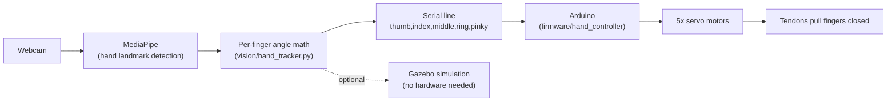

# Mimic

A webcam watches your hand. A robot hand copies it, in real time, finger by finger.

This is the documentation for the [Mimic](https://github.com/umersanii/Mimic) project: a
hobbyist build of a **tendon-driven robotic hand** that mirrors your real hand's finger movements,
captured through an ordinary webcam. No gloves, no sensors on your hand — just a camera and some
computer vision.

It's inspired by [pathofseb's](https://www.youtube.com/@pathofseb) build on YouTube.

## What "tendon-driven" means

Your own fingers don't have muscles inside them — the muscles that curl your fingers live in your
forearm, and pull on tendons that run down through your wrist into each finger, like strings on a
puppet. This hand copies that trick: a servo motor pulls a piece of fishing line (the "tendon")
threaded through the finger, curling it. A small elastic band pulls the finger back straight when
the servo releases tension. One motor, one string, one finger.

## The pipeline, in one sentence

**Webcam → hand-tracking AI → finger angles → serial cable → Arduino → servos → tendons → fingers curl.**

See [Architecture](architecture.md) for the full breakdown of each stage, or jump straight to
[Getting Started](getting-started.md) to run the vision pipeline yourself — you don't need the
physical hand built to try it.

## Project status

- **Vision pipeline**: working, live-tested against a real webcam.
- **Simulation**: working — a physically accurate 3D hand model responds to the same vision pipeline
  in Gazebo, useful for testing without hardware.
- **Physical hardware**: not yet built. See [Hardware & BOM](hardware.md) for the open decisions
  (which hand model to 3D print, servo power supply) before ordering parts.

## Who this project is for

This is a learning project first, a finished product second. The docs here are written to be
readable by someone who's never touched robotics, while still including the real technical
details (angle math, serial protocols, physics engine quirks) for anyone who wants to build their
own or understand exactly how it works. If a term trips you up, check the [Glossary](glossary.md).
