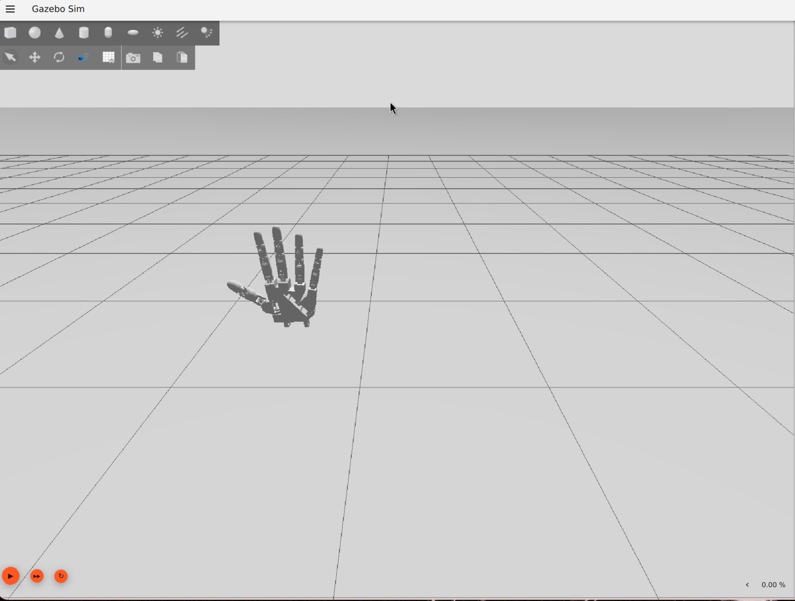

# Simulation (Gazebo)

The simulation lets the vision pipeline drive a physically accurate 3D hand model **before** the
real hardware exists, useful for testing tracking, tuning, and the control pipeline without
waiting on a 3D printer or wiring.

Stack: **Gazebo Sim (Harmonic) + ROS2 Jazzy**, run in Docker.

<video src="../assets/img/sim-mirror-demo.mp4" autoplay loop muted playsinline style="width:100%;border-radius:8px;"></video>

*The vision pipeline's HUD (top left) driving the simulated hand in real time:
`hand_tracker.py --no-serial --gazebo`.*



## Setup

```fish
cd sim/docker
docker build -t robotics-gazebo .
./run.sh
```

`run.sh` mounts the whole `sim/` directory to `/sim` in the container (not just `worlds/`, since
mesh files live under `sim/models/`), sets `GZ_SIM_RESOURCE_PATH=/sim/models`, and names the
container `robotics_gazebo_sim`, a stable name that other tooling (like the vision bridge) targets
with `docker exec`.

## World files

- **`sim/worlds/box_world.sdf`**: a minimal learning rig (pendulum, hinge, box) for getting a feel
  for Gazebo joints and physics before touching the hand model. Uses the `dartsim` physics engine.
- **`sim/worlds/hand_world.sdf`** + **`sim/models/hand/{left,right}/`**: the actual hand model —
  both hands, fixed in space via a world-mount joint so fingers/wrist can be exercised directly
  through `JointPositionController` topics without an arm or gravity-compensation setup. Uses
  `bullet-featherstone`, not `dartsim`. See [why](#the-mimic-joint-physics-engine-gotcha) below.
- The world also stages a `workbench` (table) and `backdrop_wall` around the hands, plus a `sun`
  key light and two dim `fill_light_*` point lights, so it renders as a small workshop scene
  rather than two hands floating in a void. See
  [Environment staging](#environment-staging-workbench-backdrop-lighting) below.
- **`sim/worlds/gui/{left_hand,right_hand}.config`**: `--gui-config` camera presets, picked at
  launch time (stock `gz-sim` has no in-session preset switcher):
  ```fish
  gz sim -g sim/worlds/gui/left_hand.config sim/worlds/hand_world.sdf
  ```
  Launching without `-g` uses the world's own overview camera instead.

## The hand model's provenance

### 2nd generation: MyRobotLab/inmoov_ros meshes, both hands

`sim/models/hand/{left,right}/hand.urdf` are **generated**, not hand-authored — by
[`sim/models/hand/generate_hand.py`](https://github.com/umersanii/Mimic/blob/main/sim/models/hand/generate_hand.py),
checked into the repo. It builds each side's URDF from mesh + joint-origin data transcribed out of
[MyRobotLab/inmoov_ros](https://github.com/MyRobotLab/inmoov_ros)'s `inmoov_description` /
`inmoov_meshes` packages (CC-licensed — `LICENSE.txt` is copied into each side's directory).

This replaced a 1st-generation model extracted from
[Sentience-Robotics/inmoov_ros_sim](https://github.com/Sentience-Robotics/inmoov_ros_sim)'s
whole-body sim rig, which had rougher meshes (that repo optimized for physics/joint structure, not
visual quality) and only covered the left hand.

**Full regeneration pipeline** (needs `gz` on `PATH` — run inside the `robotics-gazebo` container):

```fish
python3 generate_hand.py                    # writes {left,right}/hand.urdf
gz sdf -p left/hand.urdf > left/hand.sdf    # and the same for right/
gz sdf -p right/hand.urdf > right/hand.sdf
python3 build_world.py                       # assembles sim/worlds/hand_world.sdf
```

`build_world.py` fixes up mesh URIs (relative-to-itself in `hand.sdf`, but relative-to-`worlds/`
once embedded in `hand_world.sdf`) and re-adds visual material, since `gz sdf -p` silently drops a
URDF's `<material><color/></material>` during conversion.

!!! warning "Regenerating the world overwrites hand-tuned staging"
    `build_world.py` is a from-scratch template — it does **not** know about the workbench,
    backdrop, lighting, or the PID gains described below. Running it will silently revert all of
    that back to defaults. If you need to touch a joint's geometry, prefer a targeted edit of the
    generated `hand.sdf`/`hand.urdf` plus a surgical patch to `hand_world.sdf`, or be ready to
    reapply the staging/tuning by hand afterward.

Why transcribed by hand instead of run through the real `xacro` toolchain: the source repo's
`asmHand.urdf.xacro` macro is parameterized by `side`/`flip` exactly the way this project needs
(mirrors correctly, no manual mirroring math), but its joint-limit properties resolve through
`$(find inmoov_bringup)/config/config.yaml` via real ROS package-path resolution — not worth
standing up a colcon workspace for a one-time generation step. `generate_hand.py` resolves the
same macro logic (side/flip substitution) directly in Python instead.

A few values intentionally do **not** carry over from the source repo:

- **Joint limits/velocity** keep this project's existing `0..1.5708` rad / `0.7854` rad/s
  convention (matching `sim/bridge/gz_hand_bridge.py`'s `JOINT_MAX_RAD` scaling) rather than the
  source's `config.yaml` `minGoal`/`maxGoal`, which is real per-servo calibration in degrees tied
  to different hardware.
- **Inertial values** are box-formula inertia from hand-estimated masses (~5-90g per link, by
  structural role), computed from each mesh's own STL bounding box — not the source's
  `config.inertial.urdf.xacro` macros, whose mass units are ambiguous and not worth trusting
  unverified.
- **Coupling ratios.** See driver-joint topology below.

### Driver-joint topology (redesigned, not copied)

The source repo picks the *middle* joint of each 3-joint finger chain as the tendon-driven
"actuated" joint (e.g. `index_joint`, between `index1_link` and `index2_link`), with `index1_joint`
— upstream, closer to `hand_link` — mimicking it. That pattern doesn't work here: see the
[upstream-mimic gotcha](#the-mimic-joint-physics-engine-gotcha) below.

`generate_hand.py` reassigns the driver to whichever joint in each finger chain sits directly off
`hand_link` (e.g. `index1_joint`), with every other joint in that chain mimicking it 1:1. The
source repo's non-1:1 coupling ratios (e.g. `thumb1 = 0.75 * thumb`, `ring1 = -0.1 * ring`, tuned
for the *other* joint being the driver) were dropped in favor of flat 1:1 mimics — still a
coordinated curl, just not a literal reproduction of the source robot's exact coupling.

### Wrist joint

`wrist_joint` (`forearm_link` → `hand_link`, axis `(0,0,1)`) is the real InMoov
`{l,r}_wrist_roll_joint` from the source repo's full-body assembly (`inmoov.urdf.xacro`), not
invented for this project. It has its own `JointPositionController` topic per side
(`/inmoov_{left,right}_hand/wrist_joint/cmd_pos`), so it's testable via `gz topic pub`, but nothing
in `vision/hand_tracker.py` or the bridge drives it yet — 2D MediaPipe landmarks can't reliably
estimate forearm roll without the forearm in view. Left and right have mirrored ranges (right:
`-π..0`, left: `0..π`) — command within the correct side's range or the controller silently can't
reach the target.

### Mount pose convention

Each hand's per-model `<pose>` carries a 180° roll + 90° yaw correction. With that roll, the
forearm/hand assembly extends *upward* from `base_link`'s origin (fingers up) — `base_link`'s
origin is effectively the forearm's cut/elbow end, not the fingertip end. Both hands mount at
`z=0.45`, the workbench's top surface, so each hand visually stands up from the table on that
elbow end.

## Environment staging: workbench, backdrop, lighting

`hand_world.sdf` stages a small workshop scene around the hands rather than leaving them floating
in a void:

- **`workbench`**: a table the hands stand on. It's modeled as **one link with 5
  collision/visual elements** (table top + 4 legs), not 5 separate links — `bullet-featherstone`
  rejects any model with more than one link and no joints connecting them ("Multiple sub-trees /
  floating links detected... not supported"), even for a purely static prop with no physics need
  for a joint tree. Any future static multi-part prop in this world needs the same one-link
  pattern.
- **`backdrop_wall`**: placed at `y=-0.45`, tied to the overview camera's viewing direction. The
  camera pose (`0.5 0.5 1.3 0 0.3 -2.35`) sits at +x/+y looking toward the origin, so the open/front
  side is +y and "behind" the hands is -y. Moving the overview camera without checking this will
  point it back through the wall.
- **Lighting**: a `sun` directional key light plus `fill_light_left`/`fill_light_right`, two dim
  point lights on the camera's side (`y=+0.6`) for workshop "softbox" fill, so the hands don't read
  as flat/silhouetted from the overhead sun alone. They were originally placed at `y=-0.6` —
  *behind* the backdrop wall — by mistake, and did nothing since the wall blocked them from ever
  reaching the hands.

## The mimic-joint physics engine gotcha

This is the single most important thing to know if you're extending this simulation:

!!! warning "`dartsim` silently ignores `<mimic>` joints"
    `box_world.sdf` uses `dartsim`, and that's fine for a pendulum/hinge/box learning rig. But this
    Gazebo build's `dartsim` **silently ignores `<mimic>` constraints**. It logs "physics engine
    does not support mimic constraints" and just leaves the joint free/unconstrained. Nothing
    crashes; the mimic'd joints just... don't mimic.

    `bullet-featherstone` was verified to apply mimic correctly (tested: commanding one driver
    joint moved all 3 mimic-coupled finger joints together, as intended) — **but only when the
    driver joint is proximal** (attached directly to `hand_link`) **and every mimic joint is
    downstream of it** in the kinematic tree. A driver with an *upstream* mimic joint (closer to
    the tree root than the driver itself) silently gets zero effective torque. This is why
    `generate_hand.py` reassigns each finger's driver to the joint directly off `hand_link` — see
    [driver-joint topology](#driver-joint-topology-redesigned-not-copied) above — rather than
    keeping the source repo's original choice of driver.

    **Any new world file relying on mimic joints must set `type="bullet-featherstone"`** and add

    ```xml
    <engine><filename>gz-physics-bullet-featherstone-plugin</filename></engine>
    ```

    inside the `Physics` system plugin block. Don't copy `box_world.sdf`'s `dartsim` config for
    hand/mimic-joint work without changing this: it'll "run" with no errors and just be wrong.

## The vision to Gazebo bridge

Code: [`sim/bridge/gz_hand_bridge.py`](https://github.com/umersanii/Mimic/blob/main/sim/bridge/gz_hand_bridge.py)

This lets `vision/hand_tracker.py` (running on the host, in the `robohand` conda env) drive the
simulated hand in real time, in parallel with, or instead of, the real Arduino
(`--gazebo` flag; `--no-serial` to skip real hardware entirely).

### Why a separate process, not a library call

`gz.transport13`/`gz.msgs10` (the Python bindings for talking to Gazebo) only exist inside the
`robotics-gazebo` Docker image. The host's `robohand` conda env has no path to them (confirmed via
`apt list --installed` inside the container). So `hand_tracker.py` launches the bridge with:

```python
docker exec -i robotics_gazebo_sim python3 /sim/bridge/gz_hand_bridge.py
```

and streams one CSV line per currently-tracked hand per frame — `L,thumb,index,middle,ring,pinky`
or `R,...` (curl fractions `0.0`=straight to `1.0`=curled, the same convention
`hand_tracker.py`'s own `curls` dict uses) — over that one persistent pipe. Not a subprocess call
per frame: one process, one long-lived stdin pipe, for the whole session. If a hand leaves the
webcam frame, `hand_tracker.py` holds its last-known curls in `smoothed_angles` rather than
snapping to a default pose — losing tracking shouldn't visibly jolt the sim hand.

### Gotchas worth knowing before extending the bridge

**1. Topic names must match the driver joint name exactly.**
`hand_world.sdf`'s `JointPositionController` plugins subscribe to e.g.
`/inmoov_left_hand/index1_joint/cmd_pos` — the bridge's `JOINT_NAMES` dict must stay in sync with
whichever joint `generate_hand.py` picked as each finger's driver (see
[driver-joint topology](#driver-joint-topology-redesigned-not-copied) above), or publishes go to a
topic nobody's listening on and nothing happens, with no error.

**2. A one-shot publish right after `advertise()` can be dropped.**
Gazebo Transport discovery (multicast, finding existing subscribers) takes on the order of ~1
second. Publish once immediately after advertising and tear the process down right after, and
you can race past that discovery window with nothing delivered. This isn't an issue for the real
use case (continuous per-frame streaming for a whole session, discovery settles well within the
first second, and everything after lands normally), but it'll bite you if you write a quick one-shot
test script against the bridge.

**3. The bridge deadbands per-finger before publishing.** `DEADBAND = 0.01`: a curl value within
that tolerance of the last one actually sent for that side+finger is dropped rather than
republished. MediaPipe landmark noise passes through `hand_tracker.py`'s EMA largely intact away
from the fully-open/closed clipped extremes, so a hand held still but not at a curl extreme was
resending near-identical targets every frame. This cuts needless command traffic but was **not**
the fix for the rubber-band overshoot issue below — that was a joint-controller torque problem,
not a signal-noise problem.

## Known issue (fixed): the hand appears to jitter (it's rendering, not physics)

If you look closely at the simulated hand, even completely at rest with zero commands being sent,
it visibly jitters/shimmers.

This was diagnosed by subscribing directly to every joint's `axis1.position` at the sim's own
~1kHz update rate for 3 seconds with nothing commanded: every joint sat flat to within ~1e-8 rad.
Physics/joint state is provably static; the jitter is a **rendering artifact**, not a control or
physics instability.

Root cause (a real Gazebo/gz-sim limitation, not filed upstream): the default directional-light
shadow-map resolution/depth-bias is tuned for room/building-scale scenes (meters). This hand is
~10cm with many small phalanx meshes packed closely together, and at that scale, the default
shadow map produces shadow acne (flickering self-shadow noise) that reads visually as jitter.

The initial workaround was to disable shadows entirely (`<cast_shadows>false</cast_shadows>` on
the sun light), which avoided the jitter but left the hand flat and shadowless. The actual fix:
shadows are back on for the sun light, but `cast_shadows` is set `false` per-visual on each of the
36 individual finger-segment `<visual>` elements — the actual acne source, since it's specifically
many small, close-packed meshes — while left at its default `true` for `hand_link`/`forearm_link`
and the workbench/backdrop. That still produces a visible overall hand/arm shadow on the bench
without the small phalanx meshes flickering. Any new small finger-adjacent visual added to the
hand model needs the same `cast_shadows=false` treatment, or the acne returns for that mesh.

## Known issue (fixed): "rubber band" jitter during and after real motion

Separate from the rendering artifact above, the hand also visibly overshot and bounced back
around its target — during motion driven by the vision pipeline, and persisting afterward even
with no hand in the webcam frame. That ruled out MediaPipe landmark noise as the cause (a static
held target shouldn't need continuous correction), and pointed at the joint controllers
themselves.

**Root cause: torque saturation, not classic PID underdamping.** Each finger's driver joint is
controlled by `gz-sim-joint-position-controller-system`, and every controller in
`hand_world.sdf` used the same untuned defaults: `p_gain=5`, `d_gain=0.1`, `cmd_max`/`cmd_min=
±5` (N·m). These numbers were never sized to the model - the finger links are a few grams each,
with an effective inertia at the driver joint (own inertia + parallel-axis contribution from
every downstream mimic-linked segment, since each finger's 3-4 links move together) of roughly
`I_eff ≈ 5e-5 kg·m²` for a 3-segment finger, computed from the real per-link mass/inertia values
in the generated `hand.urdf` (see `sim/models/hand/generate_hand.py`).

Against that inertia, `cmd_max=5 N·m` is enormous: any nonzero position error saturates the
controller at the torque ceiling, producing angular acceleration on the order of
`5 / 5e-5 ≈ 96,700 rad/s²`. That's a relay/bang-bang controller in disguise - full torque until
it blows past the target, full torque back the other way, repeat - independent of the nominal
P/D ratio, and independent of whether MediaPipe is currently tracking a hand (it happens on
*any* target the controller hasn't yet reached, including one it was given once and is still
converging to). It also meant `cmd_max` exceeded the URDF's own `effort=2.0` joint limit, so it
was never a meaningfully chosen value in the first place.

**Fix:** retune each finger driver joint's gains from the actual link mass/inertia instead of
copy-pasted defaults - `p_gain` and `d_gain` picked for critical damping (`d_gain = 2*sqrt(p_gain
* I_eff)`) at a settle time on the order of a camera frame or two, and `cmd_max`/`cmd_min` capped
to the peak torque a critically-damped response actually needs (plus margin), not an arbitrary
round number. Applied uniformly to all 10 finger driver joints (5 fingers x 2 hands) in
`hand_world.sdf`:

```xml
<p_gain>0.45</p_gain>
<i_gain>0</i_gain>      <!-- was 0.05: integral windup at this torque scale was another
                              oscillation source, with no steady-state droop to justify it -->
<d_gain>0.0135</d_gain>
<i_max>0.1</i_max>
<i_min>-0.1</i_min>
<cmd_max>1.0</cmd_max>  <!-- was 5: now under the URDF's own 2.0 N*m joint effort limit -->
<cmd_min>-1.0</cmd_min>
```

`wrist_joint` was deliberately left on the old defaults - it's a much larger mass (forearm +
hand, not a few-gram phalanx) and isn't vision-driven yet, so it wasn't part of this diagnosis.
If wrist control is added later, it needs its own inertia-derived gains, not these finger values.

A companion, smaller fix went into `sim/bridge/gz_hand_bridge.py`: a per-finger deadband
(`DEADBAND = 0.01`) that skips re-publishing a curl value within that tolerance of the last one
actually sent, so MediaPipe's per-frame landmark noise (which passes through the EMA smoothing
in `hand_tracker.py` largely intact away from the fully-open/closed clipped extremes) doesn't
keep resending near-identical targets every frame. This alone wasn't the fix for the rubber-band
effect - the torque saturation above was - but it's worth keeping since it cuts needless command
traffic and any residual micro-jitter from noise.

## Known issue (fixed): right hand's ring/pinky curled partway backward

Only on the right hand, and only two fingers: commanding ring and pinky to curl produced a curl
that was visibly bent partway backward instead of cleanly forward. Left hand, and every other
finger on the right hand, curled correctly.

**Root cause: a mirroring bug in `generate_hand.py`, not a per-side data-transcription error.**
The script mirrors left/right by flipping a joint's position (`y`) and `rpy` (`x`-rotation) by a
per-side `flip` factor (`-1` for left, `+1` for right), but originally left every driver joint's
rotation `axis` hardcoded the same for both sides — `(0,0,1)` for the z-axis driver joints
(`thumb1_joint`, `ring1_joint`, `pinky1_joint`), `(0,1,0)` for the y-axis ones (`index1_joint`,
`middle1_joint`).

That's fine for the axis vector's *spatial* direction — it ends up correctly mirrored in
`hand_link`'s frame either way — but not for rotation *handedness*. Under a y-mirror, a
positive-angle rotation about a z-axis reverses its physical sense (`R_z(θ) → R_z(-θ)`), while a
positive-angle rotation about a y-axis does not (`R_y(θ) → R_y(θ)`, unaffected). That asymmetry
maps exactly onto the two joint families:

- **`index1_joint`/`middle1_joint`** (axis `y`) are unaffected by the mirror-parity issue, so both
  hands curl identically — consistent with them never showing the bug.
- **`thumb1_joint`/`ring1_joint`/`pinky1_joint`** (axis `z`) *do* pick up a handedness flip on one
  side, but it only becomes visible through the `rpy` x-tilt those joints carry (that tilt is what
  mixes the z-rotation into a y/z blend in the parent frame). `thumb1_joint`'s tilt is small
  (`flip * 0.1` rad ≈ 6°), so the wrong-handed component was too tiny to notice. `ring1_joint`/
  `pinky1_joint`'s tilt is much larger (`flip * 0.7` rad ≈ 40°), so the wrong-handed component was
  large enough to visibly bend the curl backward — this bug was latent in the thumb the whole
  time, just invisible.

**Fix:** the three z-axis driver joints' `axis` is now `(0, 0, -flip)` instead of a hardcoded
`(0, 0, 1)`. Left hand (`flip=-1`) keeps its original, already-correct axis unchanged; right hand
(`flip=1`) gets it flipped. Any new z-axis driver joint added to a finger chain needs the same
`-flip` treatment in `generate_hand.py`, not a hardcoded axis vector.
